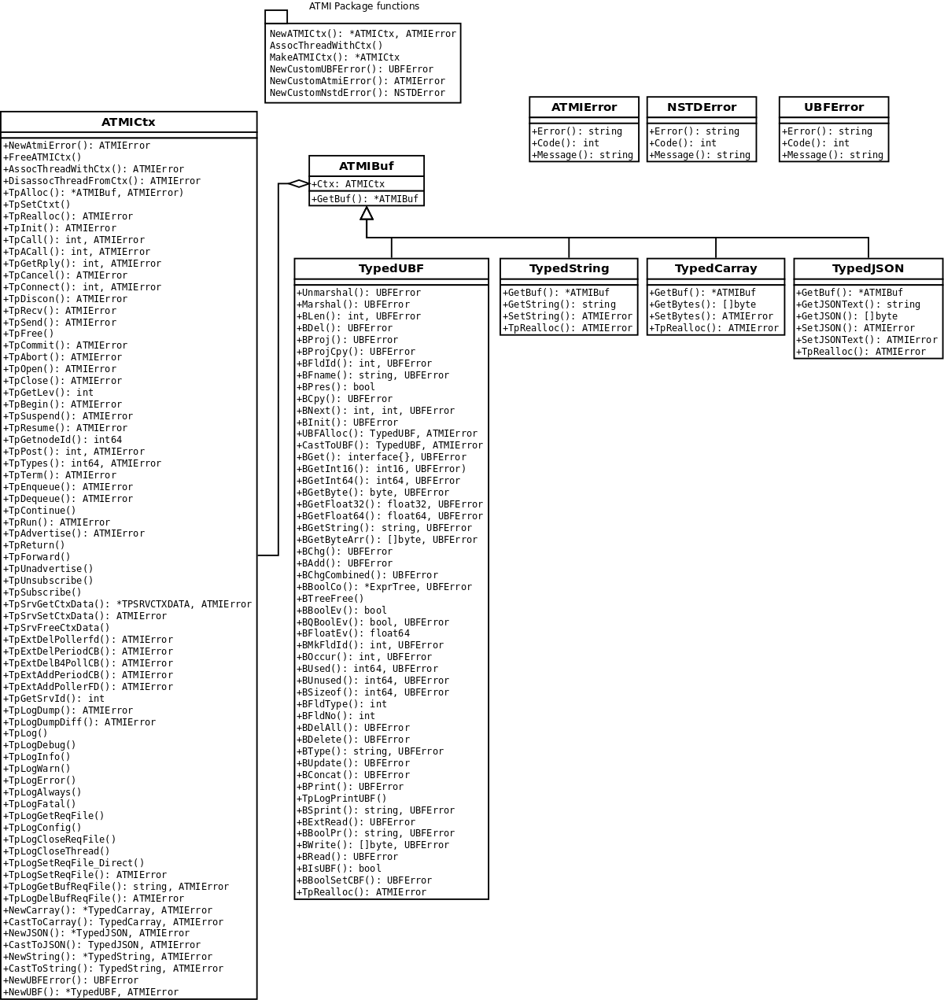

The book of the Enduro/X for Golang
===================================
Madars Vitolins
v1.0, 2016-11:
	Initial draft
:doctype: book

== Introduction

This module is set of objects that are binded to Enduro/X C based framework. 
Enduro/X by it self is middleware that uses operating system kernel queues for 
doing high performance inter-process communication. The middleware functionality 
is in the heart of the Enduro/X. Other functionality that comes in the package
is application server, which boots up the processes, monitors them (restarts is
they become dead), detects stalled services.

The processes in Enduro/X are split into to categories:

1. Client processes

2. Server processes

The client processes might be a stand alone process (executables running in system)
or it can be controlled by Enduro/X's Client Process Monitor (cpmsrv). Which gives
administrator nice interface for configuring/starting/stopping the clients.

The server processes are ones that are started by Enduro/X local daemon process
called 'ndrxd'. The server process have inside a thread which conforms the XATMI
server process workflow. At the startup the init function is called. Then threads
goes into waiting on message dispatches (waits on Posix queues). 

Once the application server is going for shutdown or administrator is about to
shutdown single server, then XATMI server process is notified of this action
and server process can gracefully do the de-init and shutdown. The uninit callback
is send to server process while doing shutdown.

== Installation on Linux operating system

To get started with endurox-go module, it is required to install

1. Go compiler

2. PKG Config package (used by endurox-go) to resolve library dependencies

=== Installing Golang on Linux box

The process of installation should very similar on other operating systems too
(i.e. OSX, FreeBSD, etc.).

Select the Download package from here: https://golang.org/dl/

The endurox-go requires Golang 1.6+

Particularity sample will run on amd64 on Linux OS:

--------------------------------------------------------------------------------
$ cd ~
$ wget https://storage.googleapis.com/golang/go1.8.linux-amd64.tar.gz
sudo tar -C /usr/local -xzf go1.8.linux-amd64.tar.gz
sudo ln -s /usr/local/go/bin/go /usr/bin/go
sudo ln -s /usr/local/go/bin/godoc /usr/bin/godoc
sudo ln -s /usr/local/go/bin/gofmt /usr/bin/gofmt
--------------------------------------------------------------------------------

=== Installing pkg config

The PKG config is needed for endurox-go to select the needed dependences. The 
Enduro/X install the pkg config file named *atmisrvinteg.pc* to system's pkgconfig
path. This is later used by golang to build endurox-go. Golang needs pkgconfig package.

Installation process on Linux Ubuntu

--------------------------------------------------------------------------------
$ sudo apt-get install pkg-config
--------------------------------------------------------------------------------

On RHEL Linux (if not already installed):

--------------------------------------------------------------------------------
$ su - root
# yum install pkgconfig
--------------------------------------------------------------------------------

Installation on FreeBSD. Also we export PKG_CONFIG_PATH. And we switch the system
to the GNU make, otherwise tests does not compile.
--------------------------------------------------------------------------------
$ su - root
# pkg install pkgconf
# pkg install gmake
# mv /usr/bin/make /usr/bin/make.orig
# ln -s /usr/local/bin/gmake /usr/bin/make
$ exit
$ export PKG_CONFIG_PATH=$PKG_CONFIG_PATH:/usr/lib/pkgconfig
--------------------------------------------------------------------------------

Or for BSD, add the PKG_CONFIG_PATH path to /etc/profile.

== API Model

The Enduro/X API object oriented where the main Enduro/X objects are held into Go
structures. List of methods are binded to the structures. Here is the main model
of the Go API:

== Enduro/X Go features

This section list the features which are supported by Go module.

- XATMI Server process

- XATMI Client process

- Distributed transaction processing (currently with patched go-oci8, which can 
be downloaded here: https://github.com/endurox-dev/go-oci8

- Debug logging infrastructure 

- Persistent queues

- Buffers: UBF, JSON, String, Binary array (carray)

- Load balancing

- High availability

== Constants
This chapter describes constants used by Enduro/X module. This includes error codes
and flags.

=== OR'able flags for different ATMI Object methods

*TPNOBLOCK* (0x00000001) - Do not block the operation (don't wait for reply or 
resource availability).

*TPSIGRSTRT* (0x00000002) - Restart the the system call if interrupted.

*TPNOREPLY* (0x00000004) - Make asynchronous call, do not wait for reply. 

*TPNOTRAN* (0x00000008) - Do not run in transaction mode.

*TPTRAN* (0x00000010) - Reserved for future use.

*TPNOTIME* (0x00000020) - Do not interrupt the call by timeout condition.

*TPGETANY* (0x00000080) - Get any call reply.

*TPNOCHANGE* (0x00000100) - Do not change buffer format. If reply on tpcall()
receives other buffer format than specified in call and this flag is set, then
error will be generated.

*TPCONV* (0x00000400) - Reserved for future use.

*TPSENDONLY* (0x00000800) - Enter in sending mode during conversational IPC.

*TPRECVONLY* (0x00001000) - Enter in receiving mode during conversational IPC.

*TPTRANSUSPEND* (0x00040000) - Suspend current transaction.

*TPSOFTTIMEOUT* (0x00080000) - Soft timout condition -> ret TPETIME, used for TpReturn()

*TPSOFTENOENT* (0x00100000) - Simulate that service is not found, used for TpReturn()

*TPNOAUTBUF* (0x00200000) - Don't restore autbuf in srv context, used for TpSrvSetCtxData()

=== ATMI buffer size
Current Enduro/X version support maximum buffer size of 64KB. The constant is
defined for that:

*ATMI_MSG_MAX_SIZE* (65536) - Max ATMI message size.

This is subject of change in future. It might that dynamic number (configurable)
will be available.

=== ATMI Error codes (returned by ATMIError interface)

This chapter lists the error codes returned by ATMI calls.

*TPMINVAL* (0) - No error.

*TPEABORT* (1) - Transaction was marked for abort.

*TPEBADDESC* (2) - Bad call descriptor.

*TPEBLOCK* (3) - Reserved for future use.

*TPEINVAL* (4) - Invalid value passed to function.

*TPELIMIT* (5) - System limits exceeded (max queues or call descriptors open).

*TPENOENT* (6) - No Entry (XATMI service or other resources).

*TPEOS* (7) - Operating system error occurred.

*TPEPERM* (8) - Reserved for future use.

*TPEPROTO* (9) - Protocol error. Invocation of XATMI functions in invalid order.

*TPESVCERR* (10) - Server error. XATMI server died during processing.

*TPESVCFAIL* (11) - Application level error at service.

*TPESYSTEM* (12) - System error.

*TPETIME* (13) - Time-out condition.

*TPETRAN* (14) - Transaction error.

*TPGOTSIG* (15) - Reserved for future use.

*TPERMERR* (16) - Resource manager error (used for distributed transactions processing)

*TPEITYPE* (17) - Reserved for future use. 

*TPEOTYPE* (18) - Invalid output type.

*TPERELEASE* (19) - Reserved for future use. 

*TPEHAZARD* (20) - Hazardous condition occurred. Transaction is partially 
committed and/or abort.

*TPEHEURISTIC* (21) - Heuristic condition occurred. Transaction is partially 
committed and/or abort.

*TPEEVENT* (22) - Event notification received for conversational IPC session.

*TPEMATCH* (23) - Did not match given identifier.

*TPEDIAGNOSTIC* (24) - Additional information is returned in diagnostics field 
(used by persistent queues API).

*TPEMIB* (25) - Reserved for future use. 

*TPINITFAIL* (30) - Reserved for future use. 

*TPMAXVAL* (31) - Maximum error code.

=== Return values for tpcall()/tpreturn()

Values for rval in tpreturn:

*TPFAIL* (0x0001) - Application level error occurred, returns tpcall() gives *TPESVCFAIL*
as error.

*TPSUCCESS* (0x0002) - Service succeeded.

=== Flags Persistent queue functions, used for TPQCTL.flags

*TPNOFLAGS* (0x00000) - No flags used.

*TPQCORRID* (0x00001) - Set/get correlation id (on set TPQCTL.corrid must
be specified.

*TPQFAILUREQ* (0x00002) - Set/get failure queue. On set TPQCTL.failurequeue must
be specified.

*TPQBEFOREMSGID* (0x00004) - RFU, enqueue before message id.

*TPQGETBYMSGIDOLD* (0x00008) - RFU, deprecated.

*TPQMSGID* (0x00010) - Get msgid of enqueued/dequeued message.

*TPQPRIORITY* (0x00020) - Set/get message priority.

*TPQTOP* (0x00040) - RFU, enqueue at queue top.

*TPQWAIT* (0x00080) - RFU, wait for dequeuing.

*TPQREPLYQ* (0x00100) - Set/get reply queue.

*TPQTIME_ABS* (0x00200) - RFU, set absolute time.

*TPQTIME_REL* (0x00400) - RFU, set absolute time.

*TPQGETBYCORRIDOLD* (0x00800) - RFU.

*TPQPEEK* (0x01000) - Peek the message from queue. Do not dequeue it permanently.

*TPQDELIVERYQOS* (0x02000) - RFU, delivery quality of service.

*TPQREPLYQOS* (0x04000) -  RFU, reply message quality of service.

*TPQEXPTIME_ABS* (0x08000) -  RFU, absolute expiration time.

*TPQEXPTIME_REL* (0x10000) -  RFU, relative expiration time.

*TPQEXPTIME_NONE* (0x20000) -  RFU, never expire.

*TPQGETBYMSGID* (0x40008) -  Dequeue by msgid.

*TPQGETBYCORRID* (0x80800) - Dequeue by corrid.

*TPQASYNC* (0x100000) - Async complete. Complete the disk based transaction asynchronously.

=== Other persistent queue sub-system constants

*TMMSGIDLEN* (32) - Message id (number of bytes). All bytes significant.

*TMCORRIDLEN* (32) - Correlator id (number of bytes). All bytes significant.

*TMQNAMELEN* (15) - Max queue name length.

*NDRX_MAX_ID_SIZE* (96) - Client ID length
	

=== Diagnostic codes for persistent queues

For persistent queue sub-system which are used by TpEnqueue(3) and TpDequeue(3)
there are special control structure used named *TPQCTL* it contains field 
*TPQCTL.diagnostic* which return diagnostic code. This field is filled in case if
*ATMIError.Code()* is set to TPEDIAGNOSTIC. Note that additional error message is
provided into *TPQCTL.diagmsg*

*QMEINVAL* (-1) - Invalid value passed to function.

*QMEBADRMID* (-2) - RFU.

*QMENOTOPEN* (-3) - RFU.

*QMETRAN* (-4) - RFU.

*QMEBADMSGID* (-5) - RFU.

*QMESYSTEM* (-6) - System error occurred. More info in logs.

*QMEOS* (-7) - Operating system error occurred. More info in logs.

*QMEABORTED* (-8) - RFU.

*QMENOTA* (-8) - RFU.

*QMEPROTO* (-9) - RFU.

*QMEBADQUEUE* (-10) - RFU.

*QMENOMSG* (-11) - No message found.

*QMEINUSE* (-12) - RFU.

*QMENOSPACE* (-13) - RFU.

*QMERELEASE* (-14) - RFU.

*QMEINVHANDLE* (-15) - RFU.

*QMESHARE* (-16) - RFU.

=== Enduro/X standard library error codes
List of error codes that can be returned by NSTDError interface:

*NEINVALINI* (1) - Invalid INI file

*NEMALLOC* (2) - Malloc failed 

*NEUNIX* (3) - Unix error occurred

*NEINVAL* (4) - Invalid value passed to function

*NESYSTEM* (5) - System failure

*NEMANDATORY* (6) - Mandatory field is missing

*NEFORMAT* (7) - Format error 

=== Unified Buffer Format (UBF) library error codes

These error codes are returned by UBFError interface:

*BMINVAL* (0) - No error.

*BERFU0* (1) - Reserved for future use.

*BALIGNERR* (2) - Invalid UBF buffer.

*BNOTFLD* (3) - Buffer not fielded/invalid UBF buffer.

*BNOSPACE* (4) - No space in buffer left.

*BNOTPRES* (5) - Field not present.

*BBADFLD* (6) - Bad field id.

*BTYPERR* (7) - Invalid field type.

*BEUNIX* (8) - Unix error.

*BBADNAME* (9) - Bad field name.

*BMALLOC* (10) - Malloc failed.

*BSYNTAX* (11) - Syntax error for boolean expression.

*BFTOPEN* (12) - Failed to open field table (ubftab).

*BFTSYNTAX* (13) - Field table (ubftab) syntax error.

*BEINVAL* (14) - Invalid value passed to function.

*BERFU1* (15) - Reserved for future use.

*BERFU2* (16) - Reserved for future use.

*BERFU3* (17) - Reserved for future use.

*BERFU4* (18) - Reserved for future use.

*BERFU5* (19) - Reserved for future use.

*BERFU6* (20) - Reserved for future use.

*BERFU7* (21) - Reserved for future use.

*BERFU8* (22) - Reserved for future use.

*BMAXVAL* (22) - Maximum error code;

=== UBF field types

This chapter lists field types (C level) used by UBF:

*BFLD_MIN* (0) - Minimum field type

*BFLD_SHORT* (0) - C Short type

*BFLD_LONG* (1) -C Long type

*BFLD_CHAR* (2) - C Chart type (single byte)

*BFLD_FLOAT* (3) - C Float type

*BFLD_DOUBLE* (4) - C Double type

*BFLD_STRING* (5) - String type

*BFLD_CARRAY* (6) - Byte array type

*BFLD_MAX* (6) - Maximum field type

=== UBF reserved field IDs

*BBADFLDID* (0) - Bad field id, used as terminator Bproj() and other calls.

*BFIRSTFLDID* (0) - First field id, used indicator for Bnext() to iterate through
the buffer.

=== Log levels
Enduro/X provides logging API (see ATMICtx.TpLog() and related functions).
Following debug levels are supported:

*LOG_ALWAYS* (1) - Fatal error. Logs always.

*LOG_ERROR* (2) - Error message.

*LOG_WARN* (3) - Warning message.

*LOG_INFO* (4) - informational message.

*LOG_DEBUG* (5) - Debug message.

*LOG_DUMP* (6) - Very detailed debug with full dumps.

=== Log Facilities

Enduro/X logging can be configured for different logging sources which includes
Enduro/X debugging it self (provides separation for base ATMI (*NDRX*), Unified 
Buffer Format (*UBF*) functions). The user logging are configured under the *TP* facility.

User logging can be associated in following levels:

- Per process;

- Per thread (for Go it is Context).

- Per request (associate with Context, i.e. if thread logging enabled, then it can be
promoted to request logging by *ATMICtx.TpLogSetReqFile()*).

*LOG_FACILITY_NDRX* (0x00001) - Settings for ATMI logging.

*LOG_FACILITY_UBF* (0x00002) - Settings for UBF logging.

*LOG_FACILITY_TP* (0x00004) - Settings for TP logging.

*LOG_FACILITY_TP_THREAD* (0x00008) - Settings for TP, thread based logging.

*LOG_FACILITY_TP_REQUEST* (0x00010) - Request logging, thread based.

== Structures

This section lists the exported (public) structures provided by Endurox-Go module.

[cols="h,5a",options="header"]
|===
|Struct/interface
|Description

|TPTRANID
|Transaction identifier

|ATMICtx
|ATMI Context object

|TPSRVCTXDATA
|Server Context data used for copying request context from one Context to another

|TPEVCTL
|Event control structure (see bellow for more information)

|TPQCTL
|Queue control structure (see bellow for more information)

|ATMIBuf
|ATMI buffer object (abstract one)

|TypedBuffer
|Interface to ATMIBuf. Provides getter for getting raw buffer handler

|TypedUBF
|Interface to UBF buffer.

|TypedCarray
|Interface to byte array buffer.

|TypedString
|Interface to String buffer.

|TypedJSON
|Interface to JSON buffer.

|ATMIError
|ATMI Error interface. Provides Error(), Code(), Message() methods.

|UBFError
|UBF library error interface. Provides Error(), Code(), Message() methods.

|NSTDError
|Stndard library error interface. Provides Error(), Code(), Message() methods.

|TPSVCINFO
|XATMI service call descriptor, provided to called service as parameters.
(see bellow for more information)
|===

=== Event control structure - TPEVCTL

--------------------------------------------------------------------------------
/*
 * Event controll struct
 */
type TPEVCTL struct {
	flags int64
	name1 string
	name2 string
}
--------------------------------------------------------------------------------

TPEVCTL is used by ATMICtx.TpSubscribe() function. TPEVCTL structure contains following fields:

- *flags* int64 - can be set to: TPEVSERVICE, TPEVPERSIST

- *name1* string - Event expression

- *name2* string - RFU.

See tpsubscribe(3) C manpage.

=== Queue operations control structure - TPQCTL

Queue control structure is self explanatory.

--------------------------------------------------------------------------------
/*
 * Queue control structure
 */
type TPQCTL struct {
	flags        int64             /* indicates which of the values are set */
	deq_time     int64             /* RFU, absolute/relative  time for dequeuing */
	priority     int64             /* RFU, enqueue priority */
	diagnostic   int64             /* indicates reason for failure */
	diagmsg      string            /* diagnostic message */
	msgid        [TMMSGIDLEN]byte  /* id of message before which to queue */
	corrid       [TMCORRIDLEN]byte /* correlation id used to identify message */
	replyqueue   string            /* queue name for reply message */
	failurequeue string            /* queue name for failure message */
	cltid        string            /* client identifier for originating client */
	urcode       int64             /* RFU, application user-return code */
	appkey       int64             /* RFU, application authentication client key */
	delivery_qos int64             /* RFU, delivery quality of service  */
	reply_qos    int64             /* RFU, reply message quality of service  */
	exp_time     int64             /* RFU, expiration time  */
}
--------------------------------------------------------------------------------

=== Incoming service call information structure - TPSVCINFO
When XATMI server receives request, it receives a control structure with information
about sender and meta data about service which actually is invoked. For example:

--------------------------------------------------------------------------------

package main

import (
        "atmi"
        "fmt"
        "os"
)

//Service func
//Here svc contains the caller infos
func TESTSVC(ac *atmi.ATMICtx, svc *atmi.TPSVCINFO) {

        ac.TpReturn(atmi.TPSUCCESS, 0, &ub, 0)

}

//Server boot/init
func Init(ac *atmi.ATMICtx) int {

        //Advertize TESTSVC
        if err := ac.TpAdvertise("TESTSVC", "TESTSVC", TESTSVC); err != nil {
                fmt.Println(err)
                return atmi.FAIL
        }

        return atmi.SUCCEED
}

//Server shutdown
func Uninit(ac *atmi.ATMICtx) {
        fmt.Println("Server shutting down...")
}

//Server main
func main() {
        //Have some context
        ac, err := atmi.NewATMICtx()

        if nil != err {
                fmt.Errorf("Failed to allocate cotnext!", err)
                os.Exit(atmi.FAIL)
        } else {
                //Run as server
                ac.TpRun(Init, Uninit)
        }
}

--------------------------------------------------------------------------------

TPSVCINFO is defined as follows (with explanatory comments):

--------------------------------------------------------------------------------
//Servic call info
type TPSVCINFO struct {
	Name   string   /* Service name */
	Data   ATMIBuf  /* Buffer type */
	Flags  int64    /* Flags used for service invation */
	Cd     int      /* Call descriptor (generated by client) */
	Cltid  string   /* Client ID string - full client queue name */
	Appkey int64    /* RFU */
	Fname  string   /* Function name invoked (set at TpAdvertise second param) */
	Ctx    *ATMICtx /* ATMI Server Context */
}
--------------------------------------------------------------------------------

The TPSVCINFO.Ctx basically is the same context passed into service function as
first argument.

== API

Section lists API functions in following levels:

- ATMI package (global functions)

- ATMI Context functions

- ATMI Error functions

- UBF functions

[[gen_doc-start]]
=== ATMI Package functions
Enduro/X package functions. ATMI Context is initiated by this package.

==== atmi.MakeATMICtx()
[cols="h,5a"]
|===
|Function
|func MakeATMICtx(c_ctx C.TPCONTEXT_T) *ATMICtx
|Description
|Make context object from C pointer. Function can be used in case If doing any
direct XATMI operations and you have a C context handler. Which can be promoted
to Go level ATMI Context.. 
*c_ctx* is Context ATMI object. 
|Returns
|ATMI Context Object
|Applies
|XATMI client and server
|===

==== atmi.NewATMICtx()
[cols="h,5a"]
|===
|Function
|func NewATMICtx() (*ATMICtx, ATMIError)
|Description
|Allocate new ATMI context. This is the context with most of the XATMI
operations are made. Single go routine can have multiple contexts at the same
time. The function does not open queues or init XATMI sub-system unless the
dependant operation is called. For example you may allocat the context and use
it for logging that will not make overhead for system queues.. 
|Returns
|ATMI Error, Pointer to ATMI Context object
|Applies
|XATMI client and server
|===

==== atmi.NewCustomATMIError()
[cols="h,5a"]
|===
|Function
|func NewCustomATMIError(code int, msg string) ATMIError
|Description
|Build a custom error. 
*err* is Error buffer to build. 
*code* is Error code to setup. 
*msg* is Error message. 
|Applies
|XATMI client and server
|===

==== atmi.NewCustomNstdError()
[cols="h,5a"]
|===
|Function
|func NewCustomNstdError(code int, msg string) NSTDError
|Description
|Build a custom error. Can be used at Go level sources To simulate standard
error. 
*err* is Error buffer to build. 
*code* is Error code to setup. 
*msg* is Error message. 
|Applies
|XATMI client and server
|===

==== atmi.NewCustomUBFError()
[cols="h,5a"]
|===
|Function
|func NewCustomUBFError(code int, msg string) UBFError
|Description
|Build a custom error. 
*err* is Error buffer to build. 
*code* is Error code to setup. 
*msg* is Error message. 
|Applies
|XATMI client and server
|===

=== Enduro/X Standard Error Object / NSTDError interface
Enduro/X standard error object interfaced with NSTDError interface. Error is returned
by libnstd library. Which are Enduro/X base library. Currently it is used for logging.

==== nstdError.Code()
[cols="h,5a"]
|===
|Function
|func (e nstdError) Code() int
|Description
|Error code getter. 
|Applies
|XATMI client and server
|===

==== nstdError.Error()
[cols="h,5a"]
|===
|Function
|func (e nstdError) Error() string
|Description
|Standard error interface. 
|Applies
|XATMI client and server
|===

==== nstdError.Message()
[cols="h,5a"]
|===
|Function
|func (e nstdError) Message() string
|Description
|Error message getter. 
|Applies
|XATMI client and server
|===

=== ATMI Error object / ATMIError interface
ATMI Error object, used for ATMI context functions. Error codes are described in
seperate chapter in this document.

==== atmiError.Code()
[cols="h,5a"]
|===
|Function
|func (e atmiError) Code() int
|Description
|code getter. 
|Applies
|XATMI client and server
|===

==== atmiError.Error()
[cols="h,5a"]
|===
|Function
|func (e atmiError) Error() string
|Description
|Standard error interface. 
|Applies
|XATMI client and server
|===

==== atmiError.Message()
[cols="h,5a"]
|===
|Function
|func (e atmiError) Message() string
|Description
|message getter. 
|Applies
|XATMI client and server
|===

=== Abstract IPC buffer - ATMIUbf
ATMI buffer is base class for String, JSON, UBF (key/value with value arrays) 
and binary buffer.

==== ATMIBuf.GetBuf()
[cols="h,5a"]
|===
|Function
|func (u *ATMIBuf) GetBuf() *ATMIBuf
|Description
|Have inteface to base ATMI buffer. 
|Applies
|XATMI client and server
|===

==== ATMIBuf.TpRealloc()
[cols="h,5a"]
|===
|Function
|func (buf *ATMIBuf) TpRealloc(size int64) ATMIError
|Description
|Reallocate the buffer. 
*buf* is ATMI buffer. 
|Returns
|ATMI Error
|Applies
|XATMI client and server
|===

==== ATMIBuf.TpSetCtxt()
[cols="h,5a"]
|===
|Function
|func (buf *ATMIBuf) TpSetCtxt(ac *ATMICtx)
|Description
|Change the context of the buffers (needed for error handling). 
|Applies
|XATMI client and server
|===

==== ATMIBuf.TpTypes()
[cols="h,5a"]
|===
|Function
|func (ptr *ATMIBuf) TpTypes(itype *string, subtype *string) (int64, ATMIError)
|Description
|Return ATMI buffer info. 
*itype* is ptr to string to return the buffer type  (can be nil), if set then
on output value will be UBF, CARRAY, STRING or JSON other buffers currently are
not supported.. 
*subtype* is ptr to string to return sub-type (can be nil). 
|Returns
|Buffer lenght if no error or -1 if error, ATMI error
|Applies
|XATMI client and server
|===

=== ATMI Context
ATMI Context is uses as main object for accessing Enduro/X functionality. The
object is allocated by package function *atmi.NewATMICtx()*. ATMI Context API is
used for client and server API.

==== ATMICtx.AssocThreadWithCtx()
[cols="h,5a"]
|===
|Function
|func (ac *ATMICtx) AssocThreadWithCtx() ATMIError
|Description
|Associate current OS thread with context This might be needed for global
transaction processing Which uses underlaying OS threads for transaction
association. 
|Applies
|XATMI client and server
|===

==== ATMICtx.BBoolCo()
[cols="h,5a"]
|===
|Function
|func (ac *ATMICtx) BBoolCo(expr string) (*ExprTree, UBFError)
|Description
|Compile boolean expression TODO: might want auto finalizer with Btreefree!. 
*expr* is Expression string. 
|Returns
|Expression tree (ptr or nil on error), UBF error
|Applies
|XATMI client and server
|===

==== ATMICtx.BBoolPr()
[cols="h,5a"]
|===
|Function
|func (ac *ATMICtx) BBoolPr(tree *ExprTree) (string, UBFError)
|Description
|Print the expression tree. 
*tree* is Compiled expression tree. 
|Returns
|printed expresion string, ubf error
|Applies
|XATMI client and server
|===

==== ATMICtx.BBoolSetCBF()
[cols="h,5a"]
|===
|Function
|func (ac *ATMICtx) BBoolSetCBF(funcname string, f UBFExprFunc) UBFError
|Description
|Set custom callback function for UBF buffer expression evaluator. 
*funcname* is Name of the function to be used in expression. 
*f* is callback to function. 
|Returns
|UBF error
|Applies
|XATMI client and server
|===

==== ATMICtx.BConcat()
[cols="h,5a"]
|===
|Function
|func (ac *ATMICtx) BConcat(dest *TypedUBF, src *TypedUBF) UBFError
|Description
|Contact the buffers. 
*dest* is dest buffer. 
*src* is source buffer. 
|Returns
|UBF error
|Applies
|XATMI client and server
|===

==== ATMICtx.BCpy()
[cols="h,5a"]
|===
|Function
|func (ac *ATMICtx) BCpy(dest *TypedUBF, src *TypedUBF) UBFError
|Description
|Copy buffer. 
*dest* is Destination UBF buffer. 
*src* is Source UBF buffer. 
|Returns
|UBF error
|Applies
|XATMI client and server
|===

==== ATMICtx.BFldId()
[cols="h,5a"]
|===
|Function
|func (ac *ATMICtx) BFldId(fldnm string) (int, UBFError)
|Description
|Return field ID. 
*fldnm* is Field name. 
|Returns
|Field ID, UBF error
|Applies
|XATMI client and server
|===

==== ATMICtx.BFldNo()
[cols="h,5a"]
|===
|Function
|func (ac *ATMICtx) BFldNo(bfldid int) int
|Description
|Return field number. 
*bfldid* is field id. 
|Returns
|field number
|Applies
|XATMI client and server
|===

==== ATMICtx.BFldType()
[cols="h,5a"]
|===
|Function
|func (ac *ATMICtx) BFldType(bfldid int) int
|Description
|Return the field type. 
*bfldid* is field id. 
|Returns
|field type
|Applies
|XATMI client and server
|===

==== ATMICtx.BFname()
[cols="h,5a"]
|===
|Function
|func (ac *ATMICtx) BFname(bfldid int) (string, UBFError)
|Description
|Get field name. 
*bfldid* is Field ID. 
|Returns
|Field name (or "" if error), UBF error
|Applies
|XATMI client and server
|===

==== ATMICtx.BInit()
[cols="h,5a"]
|===
|Function
|func (ac *ATMICtx) BInit(u *TypedUBF, ulen int64) UBFError
|Description
|Initialize/re-initialize UBF buffer. 
*u* is UBF buffer. 
*ulen* is lenght of the buffer. 
|Returns
|UBF error
|Applies
|XATMI client and server
|===

==== ATMICtx.BMkFldId()
[cols="h,5a"]
|===
|Function
|func (ac *ATMICtx) BMkFldId(fldtype int, bfldid int) (int, UBFError)
|Description
|Generate Field ID. 
*fldtype* is Field type (see BFLD_SHORT cost list). 
*bfldid* is field number. 
|Returns
|field id or 0 if error, UBF error
|Applies
|XATMI client and server
|===

==== ATMICtx.BProjCpy()
[cols="h,5a"]
|===
|Function
|func (ac *ATMICtx) BProjCpy(dest *TypedUBF, src *TypedUBF, fldlist []int)
UBFError
|Description
|Make a project copy of the fields (leave only those in array). 
|Returns
|UBF error
|Applies
|XATMI client and server
|===

==== ATMICtx.BTreeFree()
[cols="h,5a"]
|===
|Function
|func (ac *ATMICtx) BTreeFree(tree *ExprTree)
|Description
|Free the expression buffer. 
|Applies
|XATMI client and server
|===

==== ATMICtx.BUpdate()
[cols="h,5a"]
|===
|Function
|func (ac *ATMICtx) BUpdate(dest *TypedUBF, src *TypedUBF) UBFError
|Description
|Update dest buffer with source buffer data. 
*dest* is dest buffer. 
*src* is source buffer. 
|Returns
|UBF error
|Applies
|XATMI client and server
|===

==== ATMICtx.BVSizeof()
[cols="h,5a"]
|===
|Function
|func (ac *ATMICtx) BVSizeof(view string) (int64, UBFError)
|Description
|Get structure size in bytes. See Bvsizeof(3).. 
*view* is View name. 
|Returns
|ret (number of view bytes (if no error)), UBFError in case of error
|Applies
|XATMI client and server
|===

==== ATMICtx.CastToCarray()
[cols="h,5a"]
|===
|Function
|func (ac *ATMICtx) CastToCarray(abuf *ATMIBuf) (*TypedCarray, ATMIError)
|Description
|Get the String Handler. 
|Applies
|XATMI client and server
|===

==== ATMICtx.CastToJSON()
[cols="h,5a"]
|===
|Function
|func (ac *ATMICtx) CastToJSON(abuf *ATMIBuf) (*TypedJSON, ATMIError)
|Description
|Get the JSON Handler from ATMI Buffer. 
|Applies
|XATMI client and server
|===

==== ATMICtx.CastToString()
[cols="h,5a"]
|===
|Function
|func (ac *ATMICtx) CastToString(abuf *ATMIBuf) (*TypedString, ATMIError)
|Description
|Get the String Handler from ATMI Buffer. 
|Applies
|XATMI client and server
|===

==== ATMICtx.CastToUBF()
[cols="h,5a"]
|===
|Function
|func (ac *ATMICtx) CastToUBF(abuf *ATMIBuf) (*TypedUBF, ATMIError)
|Description
|Get the UBF Handler. 
|Applies
|XATMI client and server
|===

==== ATMICtx.CastToVIEW()
[cols="h,5a"]
|===
|Function
|func (ac *ATMICtx) CastToVIEW(abuf *ATMIBuf) (*TypedVIEW, ATMIError)
|Description
|Get the view buffer handler. Usually used by service functions when request is
received.. 
*abuf* is ATMI buffer. 
|Returns
|Typed view (if OK), nil on error. ATMI error in case of error or nil
|Applies
|XATMI client and server
|===

==== ATMICtx.DisassocThreadFromCtx()
[cols="h,5a"]
|===
|Function
|func (ac *ATMICtx) DisassocThreadFromCtx() ATMIError
|Description
|Disassocate current os thread from context This might be needed for global
transaction processing Which uses underlaying OS threads for transaction
association. 
|Applies
|XATMI client and server
|===

==== ATMICtx.FreeATMICtx()
[cols="h,5a"]
|===
|Function
|func (ac *ATMICtx) FreeATMICtx()
|Description
|Free up the ATMI Context Internally this will call the TpTerm too to termiante
any XATMI client session in progress.. 
|Applies
|XATMI client and server
|===

==== ATMICtx.NewATMIError()
[cols="h,5a"]
|===
|Function
|func (ac *ATMICtx) NewATMIError() ATMIError
|Description
|Generate ATMI error, read the codes. 
|Applies
|XATMI client and server
|===

==== ATMICtx.NewCarray()
[cols="h,5a"]
|===
|Function
|func (ac *ATMICtx) NewCarray(b []byte) (*TypedCarray, ATMIError)
|Description
|Allocate new string buffer. 
*s* is - source string. 
|Applies
|XATMI client and server
|===

==== ATMICtx.NewJSON()
[cols="h,5a"]
|===
|Function
|func (ac *ATMICtx) NewJSON(b []byte) (*TypedJSON, ATMIError)
|Description
|Allocate new JSON buffer. 
*s* is - source string. 
|Applies
|XATMI client and server
|===

==== ATMICtx.NewNstdError()
[cols="h,5a"]
|===
|Function
|func (ac *ATMICtx) NewNstdError() NSTDError
|Description
|Generate NSTD error, read the codes. 
|Applies
|XATMI client and server
|===

==== ATMICtx.NewString()
[cols="h,5a"]
|===
|Function
|func (ac *ATMICtx) NewString(gs string) (*TypedString, ATMIError)
|Description
|Allocate new string buffer. 
*s* is - source string. 
|Applies
|XATMI client and server
|===

==== ATMICtx.NewUBF()
[cols="h,5a"]
|===
|Function
|func (ac *ATMICtx) NewUBF(size int64) (*TypedUBF, ATMIError)
|Description
|Allocate the new UBF buffer NOTE: realloc or other ATMI ops you can do with
TypedUBF.Buf. 
*size* is - buffer size. 
|Returns
|Typed UBF, ATMI error
|Applies
|XATMI client and server
|===

==== ATMICtx.NewUBFError()
[cols="h,5a"]
|===
|Function
|func (ac *ATMICtx) NewUBFError() UBFError
|Description
|Generate UBF error, read the codes. 
|Applies
|XATMI client and server
|===

==== ATMICtx.NewVIEW()
[cols="h,5a"]
|===
|Function
|func (ac *ATMICtx) NewVIEW(view string, size int64) (*TypedVIEW, ATMIError)
|Description
|Allocate the new VIEW buffer. 
*size* is - buffer size, If use 0, then 1024 or bigger view size is allocated..

|Returns
|TypedVIEW, ATMI error
|Applies
|XATMI client and server
|===

==== ATMICtx.TpACall()
[cols="h,5a"]
|===
|Function
|func (ac *ATMICtx) TpACall(svc string, tb TypedBuffer, flags int64) (int,
ATMIError)
|Description
|TP Async call. 
*svc* is Service Name to call. 
*buf* is ATMI buffer. 
*flags* is Flags to be used for call (see flags section). 
|Returns
|Call Descriptor (cd), ATMI Error
|Applies
|XATMI client and server
|===

==== ATMICtx.TpAbort()
[cols="h,5a"]
|===
|Function
|func (ac *ATMICtx) TpAbort(flags int64) ATMIError
|Description
|Abort global transaction. 
*flags* is flags for abort operation (must be 0). 
|Returns
|ATMI Error
|Applies
|XATMI client and server
|===

==== ATMICtx.TpAdvertise()
[cols="h,5a"]
|===
|Function
|func (ac *ATMICtx) TpAdvertise(svcname string, funcname string, fptr
TPServiceFunction) ATMIError
|Description
|Advertise service. 
*svcname* is Service Name. 
*funcname* is Function Name. 
*fptr* is Pointer to service function, signature "func FUNCNAME(ac
*atmi.ATMICtx, svc *atmi.TPSVCINFO)". 
|Returns
|ATMI Error
|Applies
|To XATMI server
|===

==== ATMICtx.TpAlloc()
[cols="h,5a"]
|===
|Function
|func (ac *ATMICtx) TpAlloc(b_type string, b_subtype string, size int64)
(*ATMIBuf, ATMIError)
|Description
|Allocate buffer Accepts the standard ATMI values We should add error handling
here. 
*b_type* is Buffer type. 
*b_subtype* is Buffer sub-type. 
*size* is Buffer size request. 
|Returns
|ATMI Buffer, atmiError
|Applies
|XATMI client and server
|===

==== ATMICtx.TpAssertEqualError()
[cols="h,5a"]
|===
|Function
|func (ac *ATMICtx) TpAssertEqualError(a interface{}, b interface{}, message
string) error
|Description
|Have some common testing functinos (used by Enduro/X modules). 
*a* is Paramter a to test. 
*b* is Paramter b to test (compare with a). 
*message* is additional error message. 
|Applies
|XATMI client and server
|===

==== ATMICtx.TpAssertEqualPanic()
[cols="h,5a"]
|===
|Function
|func (ac *ATMICtx) TpAssertEqualPanic(a interface{}, b interface{}, message
string)
|Description
|Have some common testing functinos (used by Enduro/X modules). 
*a* is Paramter a to test. 
*b* is Paramter b to test (compare with a). 
*message* is additional error message. 
|Applies
|XATMI client and server
|===

==== ATMICtx.TpAssertNotEqualError()
[cols="h,5a"]
|===
|Function
|func (ac *ATMICtx) TpAssertNotEqualError(a interface{}, b interface{}, message
string) error
|Description
|Have some common testing functinos (used by Enduro/X modules). 
*a* is Paramter a to test. 
*b* is Paramter b to test (compare with a). 
*message* is additional error message. 
|Applies
|XATMI client and server
|===

==== ATMICtx.TpAssertNotEqualPanic()
[cols="h,5a"]
|===
|Function
|func (ac *ATMICtx) TpAssertNotEqualPanic(a interface{}, b interface{}, message
string)
|Description
|Have some common testing functinos (used by Enduro/X modules). 
*a* is Paramter a to test. 
*b* is Paramter b to test (compare with a). 
*message* is additional error message. 
|Applies
|XATMI client and server
|===

==== ATMICtx.TpBegin()
[cols="h,5a"]
|===
|Function
|func (ac *ATMICtx) TpBegin(timeout uint64, flags int64) ATMIError
|Description
|Begin transaction. 
*timeout* is Transaction Timeout. 
*flags* is Transaction flags. 
|Returns
|ATMI Error
|Applies
|XATMI client and server
|===

==== ATMICtx.TpCall()
[cols="h,5a"]
|===
|Function
|func (ac *ATMICtx) TpCall(svc string, tb TypedBuffer, flags int64) (int,
ATMIError)
|Description
|Do the service call, assume using the same buffer  for return value.  This
works for self describing buffers. Otherwise we need a buffer size in 
ATMIBuf.. 
*svc* is service name. 
*buf* is ATMI buffer. 
*flags* is Flags to be used. 
|Returns
|atmiError
|Applies
|XATMI client and server
|===

==== ATMICtx.TpCancel()
[cols="h,5a"]
|===
|Function
|func (ac *ATMICtx) TpCancel(cd int) ATMIError
|Description
|Cancel async call. 
*cd* is Call descriptor. 
|Returns
|ATMI error
|Applies
|XATMI client and server
|===

==== ATMICtx.TpClose()
[cols="h,5a"]
|===
|Function
|func (ac *ATMICtx) TpClose() ATMIError
|Description
|Close XA Sub-system. 
|Returns
|ATMI Error
|Applies
|XATMI client and server
|===

==== ATMICtx.TpCommit()
[cols="h,5a"]
|===
|Function
|func (ac *ATMICtx) TpCommit(flags int64) ATMIError
|Description
|Commit global transaction. 
*flags* is flags for abort operation. 
|Applies
|XATMI client and server
|===

==== ATMICtx.TpConnect()
[cols="h,5a"]
|===
|Function
|func (ac *ATMICtx) TpConnect(svc string, tb TypedBuffer, flags int64) (int,
ATMIError)
|Description
|Connect to service in conversational mode. 
*svc* is Service name. 
*data* is ATMI buffers. 
*flags* is Flags. 
|Returns
|call descriptor (cd), ATMI error
|Applies
|XATMI client and server
|===

==== ATMICtx.TpContinue()
[cols="h,5a"]
|===
|Function
|func (ac *ATMICtx) TpContinue()
|Description
|Continue main thread processing (go back to server polling). 
|Applies
|To XATMI server
|===

==== ATMICtx.TpDequeue()
[cols="h,5a"]
|===
|Function
|func (ac *ATMICtx) TpDequeue(qspace string, qname string, ctl *TPQCTL, tb
TypedBuffer, flags int64) ATMIError
|Description
|Dequeue message from Q. 
*qspace* is Name of the event to post. 
*qname* is ATMI buffer. 
*ctl* is Control structure. 
*tb* is Typed buffer. 
*flags* is ATMI call flags. 
|Returns
|ATMI error
|Applies
|XATMI client and server
|===

==== ATMICtx.TpDiscon()
[cols="h,5a"]
|===
|Function
|func (ac *ATMICtx) TpDiscon(cd int) ATMIError
|Description
|Disconnect from conversation. 
*cd* is Call Descriptor. 
|Returns
|ATMI Error
|Applies
|XATMI client and server
|===

==== ATMICtx.TpEnqueue()
[cols="h,5a"]
|===
|Function
|func (ac *ATMICtx) TpEnqueue(qspace string, qname string, ctl *TPQCTL, tb
TypedBuffer, flags int64) ATMIError
|Description
|Enqueue message to Q. 
*qspace* is Name of the event to post. 
*qname* is ATMI buffer. 
*ctl* is Control structure. 
*tb* is Typed buffer. 
*flags* is ATMI call flags. 
|Returns
|ATMI error
|Applies
|XATMI client and server
|===

==== ATMICtx.TpExtAddB4PollCB()
[cols="h,5a"]
|===
|Function
|func (ac *ATMICtx) TpExtAddB4PollCB(cb TPB4PollCallback) ATMIError
|Description
|Set periodic before poll callback func. 
*cb* is Callback function with "func(ctx *ATMICtx) int" signature. 
|Returns
|ATMI Error
|Applies
|To XATMI server
|===

==== ATMICtx.TpExtAddPeriodCB()
[cols="h,5a"]
|===
|Function
|func (ac *ATMICtx) TpExtAddPeriodCB(secs int, cb TPPeriodCallback) ATMIError
|Description
|Set periodic poll callback function. Function is called from main service
dispatcher in case if given number of seconds are elapsed. If the service is
doing some work currenlty then it will not be interrupted. If the service
workload was longer than period, then given period will be lost and will be
serviced and next sleep period or after receiving next service call.. 
*secs* is Interval in secods between calls. This basically is number of seconds
in which service will sleep and wake up.. 
*cb* is Callback function with signature: "func(ctx *ATMICtx) int".. 
|Returns
|ATMI Error
|Applies
|To XATMI server
|===

==== ATMICtx.TpExtAddPollerFD()
[cols="h,5a"]
|===
|Function
|func (ac *ATMICtx) TpExtAddPollerFD(fd int, events uint32, ptr1 interface{},
cb TPPollerFdCallback) ATMIError
|Description
|Add custom File Descriptor (FD) to Q poller. 
*events* is Epoll events. 
*ptr1* is Custom data block to be passed to callback func. 
*cb* is Callback func. 
|Returns
|ATMI Error
|Applies
|To XATMI server
|===

==== ATMICtx.TpExtDelB4PollCB()
[cols="h,5a"]
|===
|Function
|func (ac *ATMICtx) TpExtDelB4PollCB() ATMIError
|Description
|Delete before-doing-poll callback. 
|Returns
|ATMI Error
|Applies
|To XATMI server
|===

==== ATMICtx.TpExtDelPeriodCB()
[cols="h,5a"]
|===
|Function
|func (ac *ATMICtx) TpExtDelPeriodCB() ATMIError
|Description
|Delete del periodic callback. 
|Returns
|ATMI Error
|Applies
|To XATMI server
|===

==== ATMICtx.TpExtDelPollerFD()
[cols="h,5a"]
|===
|Function
|func (ac *ATMICtx) TpExtDelPollerFD(fd int) ATMIError
|Description
|Remove the polling file descriptor. 
*fd* is FD to poll on. 
|Returns
|ATMI Error
|Applies
|To XATMI server
|===

==== ATMICtx.TpForward()
[cols="h,5a"]
|===
|Function
|func (ac *ATMICtx) TpForward(svc string, tb TypedBuffer, flags int64)
|Description
|Forward the call to specified poller and return to Q poller. 
*svc* is Service name to forward the call to. 
*data* is ATMI buffer. 
*flags* is Flags. 
|Applies
|To XATMI server
|===

==== ATMICtx.TpFree()
[cols="h,5a"]
|===
|Function
|func (ac *ATMICtx) TpFree(buf *ATMIBuf)
|Description
|Free the ATMI buffer. 
*buf* is ATMI buffer. 
|Applies
|XATMI client and server
|===

==== ATMICtx.TpGetLev()
[cols="h,5a"]
|===
|Function
|func (ac *ATMICtx) TpGetLev() int
|Description
|Check are we in globa transaction?. 
|Returns
|0 - not in global Tx, 1 - in global Tx
|Applies
|XATMI client and server
|===

==== ATMICtx.TpGetRply()
[cols="h,5a"]
|===
|Function
|func (ac *ATMICtx) TpGetRply(cd *int, tb TypedBuffer, flags int64) (int,
ATMIError)
|Description
|Get async call reply. 
*cd* is call. 
*buf* is ATMI buffer. 
*flags* is call flags. 
|Applies
|XATMI client and server
|===

==== ATMICtx.TpGetSrvId()
[cols="h,5a"]
|===
|Function
|func (ac *ATMICtx) TpGetSrvId() int
|Description
|Return server id. 
|Returns
|server_id
|Applies
|To XATMI server
|===

==== ATMICtx.TpGetnodeId()
[cols="h,5a"]
|===
|Function
|func (ac *ATMICtx) TpGetnodeId() int64
|Description
|Get cluster node id. 
|Returns
|Node Id
|Applies
|XATMI client and server
|===

==== ATMICtx.TpInit()
[cols="h,5a"]
|===
|Function
|func (ac *ATMICtx) TpInit() ATMIError
|Description
|Initialize client. 
|Returns
|ATMI Error
|Applies
|XATMI client and server
|===

==== ATMICtx.TpJSONToVIEW()
[cols="h,5a"]
|===
|Function
|func (ac *ATMICtx) TpJSONToVIEW(buffer string) (*TypedVIEW, ATMIError)
|Description
|Converts string JSON buffer passed in 'buffer' to VIEW buffer. This function
will automatically allocate new VIEW buffer. See tpjsontoview(3) C call for
more information.. 
*buffer* is String buffer containing JSON message. The format must be one level
JSON containing UBF_FIELD:Value. The value can be array, then it is loaded into
occurrences.. 
|Returns
|Typed view if parsed ok, or ATMI error
|Applies
|XATMI client and server
|===

==== ATMICtx.TpLog()
[cols="h,5a"]
|===
|Function
|func (ac *ATMICtx) TpLog(lev int, format string, a ...interface{})
|Description
|Log the message to Enduro/X loggers (see tplog(3) manpage). 
*lev* is Logging level. 
*a* is arguemnts for sprintf. 
*format* is Format string for loggers. 
|Applies
|XATMI client and server
|===

==== ATMICtx.TpLogAlways()
[cols="h,5a"]
|===
|Function
|func (ac *ATMICtx) TpLogAlways(format string, a ...interface{})
|Description
|Log the message to Enduro/X loggers (see tplog(3) manpage) Fatal/Always level
wrapper. 
*a* is arguemnts for sprintf. 
*format* is Format string for loggers. 
|Applies
|XATMI client and server
|===

==== ATMICtx.TpLogCloseReqFile()
[cols="h,5a"]
|===
|Function
|func (ac *ATMICtx) TpLogCloseReqFile()
|Description
|Close request logger (see tplogclosereqfile(3) manpage). 
|Applies
|XATMI client and server
|===

==== ATMICtx.TpLogCloseThread()
[cols="h,5a"]
|===
|Function
|func (ac *ATMICtx) TpLogCloseThread()
|Description
|Close request logger (see tplogclosethread(3) manpage). 
|Applies
|XATMI client and server
|===

==== ATMICtx.TpLogConfig()
[cols="h,5a"]
|===
|Function
|func (ac *ATMICtx) TpLogConfig(logger int, lev int, debug_string string,
module string, new_file string) NSTDError
|Description
|Configure Enduro/X logger (see tplogconfig(3) manpage). 
*logger* is is bitwise 'ored' (see LOG_FACILITY_*). 
*lev* is is optional (if not set: -1), log level to be assigned to facilites. 
*debug_string* is optional Enduro/X debug string (see ndrxdebug.conf(5)
manpage). 
*new_file* is optional (if not set - empty string) logging output file,
overrides debug_string file tag. 
|Returns
|NSTDError - standard library error
|Applies
|XATMI client and server
|===

==== ATMICtx.TpLogDebug()
[cols="h,5a"]
|===
|Function
|func (ac *ATMICtx) TpLogDebug(format string, a ...interface{})
|Description
|Log the message to Enduro/X loggers (see tplog(3) manpage) Debug level
wrapper. 
*a* is arguemnts for sprintf. 
*format* is Format string for loggers. 
|Applies
|XATMI client and server
|===

==== ATMICtx.TpLogDelBufReqFile()
[cols="h,5a"]
|===
|Function
|func (ac *ATMICtx) TpLogDelBufReqFile(data TypedBuffer) ATMIError
|Description
|Delete request file from UBF buffer (see tplogdelbufreqfile(3) manpage). 
*data* is XATMI buffer, must be UBF type. 
|Returns
|ATMI error
|Applies
|XATMI client and server
|===

==== ATMICtx.TpLogDump()
[cols="h,5a"]
|===
|Function
|func (ac *ATMICtx) TpLogDump(lev int, comment string, ptr []byte, dumplen int)
ATMIError
|Description
|Print the byte array buffer to Enduro/X logger (see tplogdump(3) manpage). 
*lev* is Logging level (see LOG_* constants). 
*comment* is Title of the buffer dump. 
*ptr* is Pointer to buffer for dump. 
*dumplen* is Length of the bytes to dump. 
|Returns
|atmiError (in case if invalid length we have for ptr and dumplen)
|Applies
|XATMI client and server
|===

==== ATMICtx.TpLogDumpDiff()
[cols="h,5a"]
|===
|Function
|func (ac *ATMICtx) TpLogDumpDiff(lev int, comment string, ptr1 []byte, ptr2
[]byte, difflen int) ATMIError
|Description
|Function compares to byte array buffers and prints the differences to Enduro/X
logger (see tplogdumpdiff(3) manpage). 
*lev* is Logging level (see LOG_* constants). 
*comment* is Title of the buffer diff. 
*ptr1* is Pointer to buffer1 for compare. 
*ptr2* is Pointer to buffer2 for compare. 
*difflen* is Length of the bytes to compare. 
|Returns
|atmiError (in case if invalid length we have for ptr1/ptr2 and difflen)
|Applies
|XATMI client and server
|===

==== ATMICtx.TpLogError()
[cols="h,5a"]
|===
|Function
|func (ac *ATMICtx) TpLogError(format string, a ...interface{})
|Description
|Log the message to Enduro/X loggers (see tplog(3) manpage) Error level
wrapper. 
*a* is arguemnts for sprintf. 
*format* is Format string for loggers. 
|Applies
|XATMI client and server
|===

==== ATMICtx.TpLogFatal()
[cols="h,5a"]
|===
|Function
|func (ac *ATMICtx) TpLogFatal(format string, a ...interface{})
|Description
|Log the message to Enduro/X loggers (see tplog(3) manpage) Fatal/Always level
wrapper. 
*a* is arguemnts for sprintf. 
*format* is Format string for loggers. 
|Applies
|XATMI client and server
|===

==== ATMICtx.TpLogGetBufReqFile()
[cols="h,5a"]
|===
|Function
|func (ac *ATMICtx) TpLogGetBufReqFile(data TypedBuffer) (string, ATMIError)
|Description
|Get the request file name from UBF buffer (see tploggetbufreqfile(3) manpage).

*data* is XATMI buffer (must be UBF). 
|Returns
|file name, ATMI error
|Applies
|XATMI client and server
|===

==== ATMICtx.TpLogGetIflags()
[cols="h,5a"]
|===
|Function
|func (ac *ATMICtx) TpLogGetIflags() string
|Description
|Return integration flags Well we will run it in cached mode.... 
|Applies
|XATMI client and server
|===

==== ATMICtx.TpLogGetReqFile()
[cols="h,5a"]
|===
|Function
|func (ac *ATMICtx) TpLogGetReqFile() (bool, string)
|Description
|Return request logging file (if there is one currenlty in use)  (see
tploggetreqfile(3) manpage). 
|Returns
|Status (request logger open or not), full path to request file
|Applies
|XATMI client and server
|===

==== ATMICtx.TpLogInfo()
[cols="h,5a"]
|===
|Function
|func (ac *ATMICtx) TpLogInfo(format string, a ...interface{})
|Description
|Log the message to Enduro/X loggers (see tplog(3) manpage) Info level wrapper.

*a* is arguemnts for sprintf. 
*format* is Format string for loggers. 
|Applies
|XATMI client and server
|===

==== ATMICtx.TpLogSetReqFile()
[cols="h,5a"]
|===
|Function
|func (ac *ATMICtx) TpLogSetReqFile(data TypedBuffer, filename string, filesvc
string) ATMIError
|Description
|Set request file to log to (see tplogsetreqfile(3) manpage). 
*data* is pointer to  XATMI buffer (must be UBF, others will cause error),
optional. 
*filename* is field name to set (this goes to UBF buffer too, if set),
optional. 
*filesvc* is XATMI service name to call for requesting the new request file
name, optional. 
|Returns
|ATMI error
|Applies
|XATMI client and server
|===

==== ATMICtx.TpLogSetReqFileDirect()
[cols="h,5a"]
|===
|Function
|func (ac *ATMICtx) TpLogSetReqFileDirect(filename string)
|Description
|Set request logging file, direct version (see tplogsetreqfile_direct(3)
manpage) Which does operate with thread local storage If fails to open request
logging file, it will automatically fall-back to stderr.. 
*filename* is Set file name to perform logging to. 
|Applies
|XATMI client and server
|===

==== ATMICtx.TpLogWarn()
[cols="h,5a"]
|===
|Function
|func (ac *ATMICtx) TpLogWarn(format string, a ...interface{})
|Description
|Log the message to Enduro/X loggers (see tplog(3) manpage) Warning level
wrapper. 
*a* is arguemnts for sprintf. 
*format* is Format string for loggers. 
|Applies
|XATMI client and server
|===

==== ATMICtx.TpOpen()
[cols="h,5a"]
|===
|Function
|func (ac *ATMICtx) TpOpen() ATMIError
|Description
|Open XA Sub-system. 
|Returns
|ATMI Error
|Applies
|XATMI client and server
|===

==== ATMICtx.TpPost()
[cols="h,5a"]
|===
|Function
|func (ac *ATMICtx) TpPost(eventname string, tb TypedBuffer, len int64, flags
int64) (int, ATMIError)
|Description
|Post the event to subscribers. 
*eventname* is Name of the event to post. 
*data* is ATMI buffer. 
*flags* is flags. 
|Returns
|Number Of events posted, ATMI error
|Applies
|XATMI client and server
|===

==== ATMICtx.TpRecv()
[cols="h,5a"]
|===
|Function
|func (ac *ATMICtx) TpRecv(cd int, tb TypedBuffer, flags int64, revent *int64)
ATMIError
|Description
|Receive data from conversation. 
*cd* is call descriptor. 
*data* is ATMI buffer. 
*revent* is Return Event. 
|Returns
|ATMI Error
|Applies
|XATMI client and server
|===

==== ATMICtx.TpResume()
[cols="h,5a"]
|===
|Function
|func (ac *ATMICtx) TpResume(tranid *TPTRANID, flags int64) ATMIError
|Description
|Resume transaction. 
*tranid* is Transaction Id reference. 
*flags* is Flags for tran resume (must be 0). 
|Returns
|ATMI Error
|Applies
|XATMI client and server
|===

==== ATMICtx.TpReturn()
[cols="h,5a"]
|===
|Function
|func (ac *ATMICtx) TpReturn(rval int, rcode int64, tb TypedBuffer, flags
int64)
|Description
|Return the ATMI call and go to Q poller. 
*rvel* is Return value (TPFAIL or TPSUCCESS). 
*rcode* is Return code (used for custom purposes). 
*tb* is ATMI buffer. 
*flags* is Flags. 
|Applies
|To XATMI server
|===

==== ATMICtx.TpRun()
[cols="h,5a"]
|===
|Function
|func (ac *ATMICtx) TpRun(initf TPSrvInitFunc, uninitf TPSrvUninitFunc)
ATMIError
|Description
|We should pass here init & un-init functions... So that we can start the
processing. 
*initf* is callback to init function. 
*uninitf* is callback to un-init function. 
|Returns
|Enduro/X service exit code, ATMI Error
|Applies
|To XATMI server
|===

==== ATMICtx.TpSend()
[cols="h,5a"]
|===
|Function
|func (ac *ATMICtx) TpSend(cd int, tb TypedBuffer, flags int64, revent *int64)
ATMIError
|Description
|Receive data from conversation. 
*cd* is call descriptor. 
*data* is ATMI buffer. 
*revent* is Return Event. 
|Returns
|ATMI Error
|Applies
|XATMI client and server
|===

==== ATMICtx.TpSrvFreeCtxData()
[cols="h,5a"]
|===
|Function
|func (ac *ATMICtx) TpSrvFreeCtxData(data *TPSRVCTXDATA)
|Description
|Free the server context data. 
*data* is Context data block. 
|Applies
|To XATMI server
|===

==== ATMICtx.TpSrvGetCtxData()
[cols="h,5a"]
|===
|Function
|func (ac *ATMICtx) TpSrvGetCtxData() (*TPSRVCTXDATA, ATMIError)
|Description
|Get Server Call thread context data (free of *TPSRVCTXDATA must be done by
user). 
|Returns
|contect data, ATMI Error
|Applies
|To XATMI server
|===

==== ATMICtx.TpSrvSetCtxData()
[cols="h,5a"]
|===
|Function
|func (ac *ATMICtx) TpSrvSetCtxData(data *TPSRVCTXDATA, flags int64) ATMIError
|Description
|Restore thread context data. 
|Returns
|ATMI Error
|Applies
|To XATMI server
|===

==== ATMICtx.TpSubscribe()
[cols="h,5a"]
|===
|Function
|func (ac *ATMICtx) TpSubscribe(eventexpr string, filter string, ctl *TPEVCTL,
flags int64) (int64, ATMIError)
|Description
|Subscribe service to some specified event. 
*eventexpr* is Subscription ID (retruned by TPSubscribe()). 
*filter* is Event filter expression (regex). 
*ctl* is Control struct. 
*flags* is Flags. 
|Returns
|Subscription id, ATMI Error
|Applies
|To XATMI server
|===

==== ATMICtx.TpSuspend()
[cols="h,5a"]
|===
|Function
|func (ac *ATMICtx) TpSuspend(tranid *TPTRANID, flags int64) ATMIError
|Description
|Suspend transaction. 
*tranid* is Transaction Id reference. 
*flags* is Flags for suspend (must be 0). 
|Returns
|ATMI Error
|Applies
|XATMI client and server
|===

==== ATMICtx.TpTerm()
[cols="h,5a"]
|===
|Function
|func (ac *ATMICtx) TpTerm() ATMIError
|Description
|Terminate the client. 
|Returns
|ATMI error
|Applies
|XATMI client and server
|===

==== ATMICtx.TpTypes()
[cols="h,5a"]
|===
|Function
|func (ac *ATMICtx) TpTypes(ptr *ATMIBuf, itype *string, subtype *string)
(int64, ATMIError)
|Description
|Return ATMI buffer info. 
*ptr* is Pointer to ATMI buffer. 
*itype* is ptr to string to return the buffer type  (can be nil), if set then
on output value will be UBF, CARRAY, STRING or JSON other buffers currently are
not supported.. 
*subtype* is ptr to string to return sub-type (can be nil). 
|Returns
|Buffer lenght if no error or -1 if error, ATMI error
|Applies
|XATMI client and server
|===

==== ATMICtx.TpUnadvertise()
[cols="h,5a"]
|===
|Function
|func (ac *ATMICtx) TpUnadvertise(svcname string) ATMIError
|Description
|Unadvertise service dynamically. 
*svcname* is Service Name. 
|Returns
|ATMI Error
|Applies
|To XATMI server
|===

==== ATMICtx.TpUnsubscribe()
[cols="h,5a"]
|===
|Function
|func (ac *ATMICtx) TpUnsubscribe(subscription int64, flags int64) (int,
ATMIError)
|Description
|Unsubscribe from event broker. 
*subscription* is Subscription ID (retruned by TPSubscribe()). 
*flags* is Flags. 
|Returns
|Number of subscriptions deleted, ATMI Error
|Applies
|To XATMI server
|===

==== ATMICtx.UBFAlloc()
[cols="h,5a"]
|===
|Function
|func (ac *ATMICtx) UBFAlloc(size int64) (TypedUBF, ATMIError)
|Description
|Allocate the UBF buffer. 
*size* is Buffer size in bytes. 
|Returns
|UBF Handler, ATMI Error
|Applies
|XATMI client and server
|===

==== ATMICtx.UserLog()
[cols="h,5a"]
|===
|Function
|func (ac *ATMICtx) UserLog(format string, a ...interface{})
|Description
|Do the user logging. This prints the message to ULOG. Suitable for system wide
critical message notifications. 
*format* is format string. 
*a* is list of data fields for format string. 
|Applies
|XATMI client and server
|===

=== String IPC buffer format
String buffer. Can be used to string plain text strings between services. The string
buffer cannot contain binary zero (0x00) byte.

==== TypedString.GetBuf()
[cols="h,5a"]
|===
|Function
|func (u *TypedString) GetBuf() *ATMIBuf
|Description
|Return The ATMI buffer to caller. 
|Applies
|XATMI client and server
|===

==== TypedString.GetString()
[cols="h,5a"]
|===
|Function
|func (s *TypedString) GetString() string
|Description
|Get the string value out from buffer. 
|Returns
|String value
|Applies
|XATMI client and server
|===

==== TypedString.SetString()
[cols="h,5a"]
|===
|Function
|func (s *TypedString) SetString(gs string) ATMIError
|Description
|Set the string to the buffer. 
*str* is String value. 
|Applies
|XATMI client and server
|===

==== TypedString.TpRealloc()
[cols="h,5a"]
|===
|Function
|func (u *TypedString) TpRealloc(size int64) ATMIError
|Description
|. 
|Applies
|XATMI client and server
|===

=== JSON IPC buffer format
JSON buffer. Used to send JSON text between services. Basically it is string buffer,
but with special mark that it is JSON Text. This mark is special, as Enduro/X can
automatically convert JSON to UBF and vice versa. The format for JSON is one level
with UBF field names and values. Values can be arrays.

==== TypedJSON.GetBuf()
[cols="h,5a"]
|===
|Function
|func (u *TypedJSON) GetBuf() *ATMIBuf
|Description
|Return The ATMI buffer to caller. 
|Applies
|XATMI client and server
|===

==== TypedJSON.GetJSONText()
[cols="h,5a"]
|===
|Function
|func (j *TypedJSON) GetJSONText() string
|Description
|Get the string value out from buffer. 
|Returns
|JSON value
|Applies
|XATMI client and server
|===

==== TypedJSON.SetJSON()
[cols="h,5a"]
|===
|Function
|func (j *TypedJSON) SetJSON(b []byte) ATMIError
|Description
|Set JSON bytes. 
|Applies
|XATMI client and server
|===

==== TypedJSON.SetJSONText()
[cols="h,5a"]
|===
|Function
|func (j *TypedJSON) SetJSONText(gs string) ATMIError
|Description
|Set the string to the buffer. 
*str* is JSON value. 
|Applies
|XATMI client and server
|===

==== TypedJSON.TpRealloc()
[cols="h,5a"]
|===
|Function
|func (u *TypedJSON) TpRealloc(size int64) ATMIError
|Description
|. 
|Applies
|XATMI client and server
|===

=== Binary buffer IPC buffer format
Typed Carray, basically is byte array buffer.

==== TypedCarray.GetBuf()
[cols="h,5a"]
|===
|Function
|func (u *TypedCarray) GetBuf() *ATMIBuf
|Description
|Return The ATMI buffer to caller. 
|Applies
|XATMI client and server
|===

==== TypedCarray.SetBytes()
[cols="h,5a"]
|===
|Function
|func (s *TypedCarray) SetBytes(b []byte) ATMIError
|Description
|. 
*str* is String value. 
|Applies
|XATMI client and server
|===

==== TypedCarray.TpRealloc()
[cols="h,5a"]
|===
|Function
|func (u *TypedCarray) TpRealloc(size int64) ATMIError
|Description
|. 
|Applies
|XATMI client and server
|===

=== BUF Error object/ UBFError interface
==== ubfError.Code()
[cols="h,5a"]
|===
|Function
|func (e ubfError) Code() int
|Description
|code getter. 
|Applies
|XATMI client and server
|===

==== ubfError.Error()
[cols="h,5a"]
|===
|Function
|func (e ubfError) Error() string
|Description
|Standard error interface. 
|Applies
|XATMI client and server
|===

==== ubfError.Message()
[cols="h,5a"]
|===
|Function
|func (e ubfError) Message() string
|Description
|message getter. 
|Applies
|XATMI client and server
|===

=== UBF Key/value IPC buffer format
Unified Buffer Format (UBF) is key/value buffer with compiled IDs. Each key
can contain the array of elements (occurrences).

==== TypedUBF.BAdd()
[cols="h,5a"]
|===
|Function
|func (u *TypedUBF) BAdd(bfldid int, ival interface{}) UBFError
|Description
|Add field to buffer. 
*bfldid* is Field ID. 
*ival* is Input value. 
|Returns
|UBF Error
|Applies
|XATMI client and server
|===

==== TypedUBF.BBoolEv()
[cols="h,5a"]
|===
|Function
|func (u *TypedUBF) BBoolEv(tree *ExprTree) bool
|Description
|Test the expresion tree to current UBF buffer. 
*tree* is compiled expression tree. 
|Returns
|true (buffer matched expression) or false (buffer not matched expression)
|Applies
|XATMI client and server
|===

==== TypedUBF.BChg()
[cols="h,5a"]
|===
|Function
|func (u *TypedUBF) BChg(bfldid int, occ int, ival interface{}) UBFError
|Description
|Change field in buffer. 
*bfldid* is Field ID. 
*ival* is Input value. 
|Returns
|UBF Error
|Applies
|XATMI client and server
|===

==== TypedUBF.BChgCombined()
[cols="h,5a"]
|===
|Function
|func (u *TypedUBF) BChgCombined(bfldid int, occ int, ival interface{}, do_add
bool) UBFError
|Description
|Set the field value. Combined supports change (chg) or add mode. 
*bfldid* is Field ID. 
*occ* is Field Occurrance. 
*ival* is Input value. 
*do_add* is Adding mode true = add, false = change. 
|Returns
|UBF Error
|Applies
|XATMI client and server
|===

==== TypedUBF.BDel()
[cols="h,5a"]
|===
|Function
|func (u *TypedUBF) BDel(bfldid int, occ int) UBFError
|Description
|Delete the field from buffer. 
*fldid* is Field ID. 
*occ* is Field occurance. 
|Returns
|UBF error
|Applies
|XATMI client and server
|===

==== TypedUBF.BDelAll()
[cols="h,5a"]
|===
|Function
|func (u *TypedUBF) BDelAll(bfldid int) UBFError
|Description
|Delete field (all occurrances) from buffer. 
*bfldid* is field ID. 
|Returns
|UBF error
|Applies
|XATMI client and server
|===

==== TypedUBF.BDelete()
[cols="h,5a"]
|===
|Function
|func (u *TypedUBF) BDelete(fldlist []int) UBFError
|Description
|Delete listed fields from UBF buffer. 
*fldlist* is list of fields (array). 
|Returns
|UBF error
|Applies
|XATMI client and server
|===

==== TypedUBF.BExtRead()
[cols="h,5a"]
|===
|Function
|func (u *TypedUBF) BExtRead(s string) UBFError
|Description
|Read the bufer content from string. 
*s* is String buffer representation. 
|Returns
|UBF error
|Applies
|XATMI client and server
|===

==== TypedUBF.BFloatEv()
[cols="h,5a"]
|===
|Function
|func (u *TypedUBF) BFloatEv(tree *ExprTree) float64
|Description
|Evalute expression value in float64 format. 
*tree* is compiled expression tree. 
|Returns
|expression value
|Applies
|XATMI client and server
|===

==== TypedUBF.BGet()
[cols="h,5a"]
|===
|Function
|func (u *TypedUBF) BGet(bfldid int, occ int) (interface{}, UBFError)
|Description
|Get the field form buffer. This returns the interface to underlaying type. 
*bfldid* is Field ID. 
*occ* is Occurrance. 
|Returns
|interface to value,	 UBF error
|Applies
|XATMI client and server
|===

==== TypedUBF.BGetByte()
[cols="h,5a"]
|===
|Function
|func (u *TypedUBF) BGetByte(bfldid int, occ int) (byte, UBFError)
|Description
|Return byte (c char) value from buffer. 
*bfldid* is Field ID. 
*occ* is Occurrance. 
|Returns
|byte val, UBF error
|Applies
|XATMI client and server
|===

==== TypedUBF.BGetByteArr()
[cols="h,5a"]
|===
|Function
|func (u *TypedUBF) BGetByteArr(bfldid int, occ int) ([]byte, UBFError)
|Description
|Get string value. 
*bfldid* is Field ID. 
*occ* is Occurrance. 
|Returns
|string val, UBF error
|Applies
|XATMI client and server
|===

==== TypedUBF.BGetFloat32()
[cols="h,5a"]
|===
|Function
|func (u *TypedUBF) BGetFloat32(bfldid int, occ int) (float32, UBFError)
|Description
|Get float value from UBF buffer, see CBget(3). 
*bfldid* is Field ID. 
*occ* is Occurrance. 
|Returns
|float, UBF error
|Applies
|XATMI client and server
|===

==== TypedUBF.BGetFloat64()
[cols="h,5a"]
|===
|Function
|func (u *TypedUBF) BGetFloat64(bfldid int, occ int) (float64, UBFError)
|Description
|Get double value. 
*bfldid* is Field ID. 
*occ* is Occurrance. 
|Returns
|double, UBF error
|Applies
|XATMI client and server
|===

==== TypedUBF.BGetInt()
[cols="h,5a"]
|===
|Function
|func (u *TypedUBF) BGetInt(bfldid int, occ int) (int, UBFError)
|Description
|Return int (basicaly C long (int64) casted to) value from buffer. 
*bfldid* is Field ID. 
*occ* is Occurrance. 
|Returns
|int64 val,	 UBF error
|Applies
|XATMI client and server
|===

==== TypedUBF.BGetInt16()
[cols="h,5a"]
|===
|Function
|func (u *TypedUBF) BGetInt16(bfldid int, occ int) (int16, UBFError)
|Description
|Return int16 value from buffer. 
*bfldid* is Field ID. 
*occ* is Occurrance. 
|Returns
|int16 val,	 UBF error
|Applies
|XATMI client and server
|===

==== TypedUBF.BGetInt64()
[cols="h,5a"]
|===
|Function
|func (u *TypedUBF) BGetInt64(bfldid int, occ int) (int64, UBFError)
|Description
|Return int64 value from buffer. 
*bfldid* is Field ID. 
*occ* is Occurrance. 
|Returns
|int64 val,	 UBF error
|Applies
|XATMI client and server
|===

==== TypedUBF.BGetString()
[cols="h,5a"]
|===
|Function
|func (u *TypedUBF) BGetString(bfldid int, occ int) (string, UBFError)
|Description
|Get string value. 
*bfldid* is Field ID. 
*occ* is Occurrance. 
|Returns
|string val, UBF error
|Applies
|XATMI client and server
|===

==== TypedUBF.BIsUBF()
[cols="h,5a"]
|===
|Function
|func (u *TypedUBF) BIsUBF() bool
|Description
|Test C buffer for UBF format. 
|Returns
|TRUE - buffer is UBF, FALSE - not UBF
|Applies
|XATMI client and server
|===

==== TypedUBF.BLen()
[cols="h,5a"]
|===
|Function
|func (u *TypedUBF) BLen(bfldid int, occ int) (int, UBFError)
|Description
|Get the field len. 
*fldid* is Field ID. 
*occ* is Field occurance. 
|Returns
|FIeld len, UBF error
|Applies
|XATMI client and server
|===

==== TypedUBF.BNext()
[cols="h,5a"]
|===
|Function
|func (u *TypedUBF) BNext(first bool) (int, int, UBFError)
|Description
|Iterate over the buffer NOTE: This is not multiple context safe. It stores
iteration state internally. 
*first* is TRUE start iteration, FALSE continue iteration. 
|Returns
|Field ID, Field Occurrance, UBF Error
|Applies
|XATMI client and server
|===

==== TypedUBF.BOccur()
[cols="h,5a"]
|===
|Function
|func (u *TypedUBF) BOccur(bfldid int) (int, UBFError)
|Description
|Get the number of field occurrances in buffer. 
*bfldid* is Field ID. 
|Returns
|count (or -1 on error), UBF error
|Applies
|XATMI client and server
|===

==== TypedUBF.BPres()
[cols="h,5a"]
|===
|Function
|func (u *TypedUBF) BPres(bfldid int, occ int) bool
|Description
|Check for field presence in buffer. 
*fldid* is Field ID. 
*occ* is Field occurance. 
|Returns
|true/false present/not present
|Applies
|XATMI client and server
|===

==== TypedUBF.BPrint()
[cols="h,5a"]
|===
|Function
|func (u *TypedUBF) BPrint() UBFError
|Description
|Print the buffer to stdout. 
|Returns
|UBF error
|Applies
|XATMI client and server
|===

==== TypedUBF.BProj()
[cols="h,5a"]
|===
|Function
|func (u *TypedUBF) BProj(fldlist []int) UBFError
|Description
|Make a project copy of the fields (leave only those in array). 
|Returns
|UBF error
|Applies
|XATMI client and server
|===

==== TypedUBF.BQBoolEv()
[cols="h,5a"]
|===
|Function
|func (u *TypedUBF) BQBoolEv(expr string) (bool, UBFError)
|Description
|Quick eval of the expression (compiles & frees the handler automatically). 
*expr* is Expression tree. 
|Returns
|result: true or false, UBF error
|Applies
|XATMI client and server
|===

==== TypedUBF.BRead()
[cols="h,5a"]
|===
|Function
|func (u *TypedUBF) BRead(dump []byte) UBFError
|Description
|Serialize the UBF buffer. 
|Returns
|serialized bytes, UBF error
|Applies
|XATMI client and server
|===

==== TypedUBF.BSizeof()
[cols="h,5a"]
|===
|Function
|func (u *TypedUBF) BSizeof() (int64, UBFError)
|Description
|Get the total buffer size. 
|Returns
|bufer size, UBF error
|Applies
|XATMI client and server
|===

==== TypedUBF.BSprint()
[cols="h,5a"]
|===
|Function
|func (u *TypedUBF) BSprint() (string, UBFError)
|Description
|Alternative for Bfprint. Will return the output in string variable So that
caller can do anything it wants with the string output. 
|Returns
|Printed buffer, UBF error
|Applies
|XATMI client and server
|===

==== TypedUBF.BType()
[cols="h,5a"]
|===
|Function
|func (u *TypedUBF) BType(bfldid int) (string, UBFError)
|Description
|Return field name in string. 
*bfldid* is field ID. 
|Returns
|field type, UBF error
|Applies
|XATMI client and server
|===

==== TypedUBF.BUnused()
[cols="h,5a"]
|===
|Function
|func (u *TypedUBF) BUnused() (int64, UBFError)
|Description
|Get the number of free bytes of UBF buffer. 
|Returns
|buffer free bytes, UBF error
|Applies
|XATMI client and server
|===

==== TypedUBF.BUsed()
[cols="h,5a"]
|===
|Function
|func (u *TypedUBF) BUsed() (int64, UBFError)
|Description
|Get the number of bytes used in UBF buffer. 
|Returns
|number of byptes used, UBF error
|Applies
|XATMI client and server
|===

==== TypedUBF.BWrite()
[cols="h,5a"]
|===
|Function
|func (u *TypedUBF) BWrite() ([]byte, UBFError)
|Description
|Serialize the UBF buffer. 
|Returns
|serialized bytes, UBF error
|Applies
|XATMI client and server
|===

==== TypedUBF.GetBuf()
[cols="h,5a"]
|===
|Function
|func (u *TypedUBF) GetBuf() *ATMIBuf
|Description
|Return The ATMI buffer to caller. 
|Applies
|XATMI client and server
|===

==== TypedUBF.Marshal()
[cols="h,5a"]
|===
|Function
|func (u *TypedUBF) Marshal(v interface{}) UBFError
|Description
|Copy the specified fields to the local structure Copy the local struct to UBF.

*v* is local struct. 
|Returns
|UBF error
|Applies
|XATMI client and server
|===

==== TypedUBF.TpJSONToUBF()
[cols="h,5a"]
|===
|Function
|func (u *TypedUBF) TpJSONToUBF(buffer string) UBFError
|Description
|Converts string JSON buffer passed in 'buffer' to UBF buffer. This function
will automatically allocate the free space in UBF to fit the JSON. The size
will be determinated by string length. See tpjsontoubf(3) C call for more
information.. 
*buffer* is String buffer containing JSON message. The format must be one level
JSON containing UBF_FIELD:Value. The value can be array, then it is loaded into
occurrences.. 
|Returns
|UBFError ('BEINVAL' if failed to convert, 'BMALLOC' if buffer resize failed)
|Applies
|XATMI client and server
|===

==== TypedUBF.TpLogPrintUBF()
[cols="h,5a"]
|===
|Function
|func (u *TypedUBF) TpLogPrintUBF(lev int, title string)
|Description
|Print the buffer to stdout. 
|Returns
|UBF error
|Applies
|XATMI client and server
|===

==== TypedUBF.TpRealloc()
[cols="h,5a"]
|===
|Function
|func (u *TypedUBF) TpRealloc(size int64) ATMIError
|Description
|. 
|Applies
|XATMI client and server
|===

==== TypedUBF.TpUBFToJSON()
[cols="h,5a"]
|===
|Function
|func (u *TypedUBF) TpUBFToJSON() (string, ATMIError)
|Description
|Convert given UBF buffer to JSON block, see tpubftojson(3) C call Output
string is automatically allocated. 
|Returns
|JSON string (if converted ok), ATMIError in case of failure. More detailed
infos in case of error is found in 'ubf' and 'ndrx' facility logs.
|Applies
|XATMI client and server
|===

==== TypedUBF.Unmarshal()
[cols="h,5a"]
|===
|Function
|func (u *TypedUBF) Unmarshal(v interface{}) UBFError
|Description
|Copy the specified fields to the local structure according to the `ubf'. 
*v* is local struct. 
|Returns
|UBF error
|Applies
|XATMI client and server
|===

=== VIEW buffer format - dynamic access
Typed view, dynamic access to C VIEW structures via field names.

==== TypedVIEW.BVChg()
[cols="h,5a"]
|===
|Function
|func (u *TypedVIEW) BVChg(cname string, occ int, ival interface{}) UBFError
|Description
|Set view field value. See CBvchg(3).. 
*cname* is C field name of view. 
*occ* is Occurrance to set. 
*ival* is Value to set to. Note that given field is automatically converted to
specified typed in view with best possible converstion. 
|Returns
|byte array val,	 UBF error
|Applies
|XATMI client and server
|===

==== TypedVIEW.BVCpy()
[cols="h,5a"]
|===
|Function
|func (u *TypedVIEW) BVCpy(dst *TypedVIEW) (int64, UBFError)
|Description
|Copy view content to another view. 
*dst* is destination view to copy to, must be atleast in size of view. 
|Returns
|bytes copied, UBF error (or nil)
|Applies
|XATMI client and server
|===

==== TypedVIEW.BVGetByte()
[cols="h,5a"]
|===
|Function
|func (u *TypedVIEW) BVGetByte(cname string, occ int, flags int64) (byte,
UBFError)
|Description
|Return Byte (char) value from view field. See CBvget(3).. 
*cname* is C field name for view. 
*occ* is Occurrance. 
*flags* is BVACCESS_NOTNULL (do not return NULL value defined in view but
report as BNOTPRES error instead) or 0 (returns NULL values if view field is
set to). 
|Returns
|signle byte val, UBF error
|Applies
|XATMI client and server
|===

==== TypedVIEW.BVGetByteArr()
[cols="h,5a"]
|===
|Function
|func (u *TypedVIEW) BVGetByteArr(cname string, occ int, flags int64) ([]byte,
UBFError)
|Description
|Return carray/byte array BLOB value from view field. See CBvget(3).. 
*cname* is C field name of view. 
*occ* is Occurrance. 
*flags* is BVACCESS_NOTNULL (do not return NULL value defined in view but
report as BNOTPRES error instead) or 0 (returns NULL values if view field is
set to). 
|Returns
|byte array val,	 UBF error
|Applies
|XATMI client and server
|===

==== TypedVIEW.BVGetFloat32()
[cols="h,5a"]
|===
|Function
|func (u *TypedVIEW) BVGetFloat32(cname string, occ int, flags int64) (float32,
UBFError)
|Description
|Return float value from view field. See CBvget(3).. 
*cname* is C field name for view. 
*occ* is Occurrance. 
*flags* is BVACCESS_NOTNULL (do not return NULL value defined in view but
report as BNOTPRES error instead) or 0 (returns NULL values if view field is
set to). 
|Returns
|float val,	 UBF error
|Applies
|XATMI client and server
|===

==== TypedVIEW.BVGetFloat64()
[cols="h,5a"]
|===
|Function
|func (u *TypedVIEW) BVGetFloat64(cname string, occ int, flags int64) (float64,
UBFError)
|Description
|Return double value from view field. See CBvget(3).. 
*cname* is C field name for view. 
*occ* is Occurrance. 
*flags* is BVACCESS_NOTNULL (do not return NULL value defined in view but
report as BNOTPRES error instead) or 0 (returns NULL values if view field is
set to). 
|Returns
|double val,	 UBF error
|Applies
|XATMI client and server
|===

==== TypedVIEW.BVGetInt()
[cols="h,5a"]
|===
|Function
|func (u *TypedVIEW) BVGetInt(cname string, occ int, flags int64) (int,
UBFError)
|Description
|Return int value from view field. See CBvget(3).. 
*cname* is C field name for view. 
*occ* is Occurrance. 
*flags* is BVACCESS_NOTNULL (do not return NULL value defined in view but
report as BNOTPRES error instead) or 0 (returns NULL values if view field is
set to). 
|Returns
|int val,	 UBF error
|Applies
|XATMI client and server
|===

==== TypedVIEW.BVGetInt16()
[cols="h,5a"]
|===
|Function
|func (u *TypedVIEW) BVGetInt16(cname string, occ int, flags int64) (int16,
UBFError)
|Description
|Return int16 value from view field. See CBvget(3).. 
*cname* is C field name for view. 
*occ* is Occurrance. 
*flags* is BVACCESS_NOTNULL (do not return NULL value defined in view but
report as BNOTPRES error instead) or 0 (returns NULL values if view field is
set to). 
|Returns
|int16 val,	 UBF error
|Applies
|XATMI client and server
|===

==== TypedVIEW.BVGetInt64()
[cols="h,5a"]
|===
|Function
|func (u *TypedVIEW) BVGetInt64(cname string, occ int, flags int64) (int64,
UBFError)
|Description
|Return int64 value from view field. See CBvget(3).. 
*cname* is C field name for view. 
*occ* is Occurrance. 
*flags* is BVACCESS_NOTNULL (do not return NULL value defined in view but
report as BNOTPRES error instead) or 0 (returns NULL values if view field is
set to). 
|Returns
|int64 val,	 UBF error
|Applies
|XATMI client and server
|===

==== TypedVIEW.BVGetString()
[cols="h,5a"]
|===
|Function
|func (u *TypedVIEW) BVGetString(cname string, occ int, flags int64) (string,
UBFError)
|Description
|Return string value from view field. See CBvget(3).. 
*cname* is C field name of view. 
*occ* is Occurrance. 
*flags* is BVACCESS_NOTNULL (do not return NULL value defined in view but
report as BNOTPRES error instead) or 0 (returns NULL values if view field is
set to). 
|Returns
|string val,	 UBF error
|Applies
|XATMI client and server
|===

==== TypedVIEW.BVName()
[cols="h,5a"]
|===
|Function
|func (u *TypedVIEW) BVName() string
|Description
|Return view name. 
|Returns
|view name
|Applies
|XATMI client and server
|===

==== TypedVIEW.BVNext()
[cols="h,5a"]
|===
|Function
|func (u *TypedVIEW) BVNext(state *BVNextState, start bool) (int, string, int,
int, int64, UBFError)
|Description
|Iterate over the view structure - return structure fields and field infos.
When starting to iterate, "start" field must be set to true, when continue to
iterate the, the start must be set to false. In case if field is found, the
first return value (ret) will be set to 1, if EOF is reached, then ret is set
to 0. If error occurs, the ret is set to -1 and UBFError is set. 
*state* is object value to keep the state of the iteration. 
*start* is true - if start to iterate, false - if continue to iterate. 
|Returns
|ret (status -1: fail, 0: EOF, 1: Got field), cname (field name),  fldtyp
(BFLD_* type), maxocc (Max occurrences), dim_size (field size in bytes), UBF
Error if have err
|Applies
|XATMI client and server
|===

==== TypedVIEW.BVOccur()
[cols="h,5a"]
|===
|Function
|func (u *TypedVIEW) BVOccur(cname string) (int, int, int, int64, int,
UBFError)
|Description
|Get view field information, occurrences and related infos. See Bvoccur(3) C
manpage for more infos.. 
*cname* is view field name. 
|Returns
|ret (number of "C" set occs), maxocc (max occurrences fo field), realocc (real
non NULL occurrences measuring from array end), dim_size (number of bytes
stored in field (at C level)), fldtype (Field type, see BFLD_*), errU (UBF
error if set)
|Applies
|XATMI client and server
|===

==== TypedVIEW.BVSetOccur()
[cols="h,5a"]
|===
|Function
|func (u *TypedVIEW) BVSetOccur(cname string, occ int) UBFError
|Description
|Set number number of occurrences in "C_<field>" field, if "C" flag defined in
view. If flag not defined, then call succeeds but value is ignored. See
Bvsetoccur(3).. 
|Returns
|UBF error in case of error (nil on SUCCEED)
|Applies
|XATMI client and server
|===

==== TypedVIEW.BVSizeof()
[cols="h,5a"]
|===
|Function
|func (u *TypedVIEW) BVSizeof() (int64, UBFError)
|Description
|Get structure size in bytes for given TypedVIEW object. See Bvsizeof(3).. 
|Returns
|ret (number of view bytes (if no error)), UBFError in case of error
|Applies
|XATMI client and server
|===

==== TypedVIEW.GetBuf()
[cols="h,5a"]
|===
|Function
|func (u *TypedVIEW) GetBuf() *ATMIBuf
|Description
|Return The ATMI buffer to caller. 
|Applies
|XATMI client and server
|===

==== TypedVIEW.TpRealloc()
[cols="h,5a"]
|===
|Function
|func (v *TypedVIEW) TpRealloc(size int64) ATMIError
|Description
|. 
|Applies
|XATMI client and server
|===

==== TypedVIEW.TpVIEWToJSON()
[cols="h,5a"]
|===
|Function
|func (u *TypedVIEW) TpVIEWToJSON(flags int64) (string, ATMIError)
|Description
|Convert given VIEW buffer to JSON block, see tpviewtojson(3) C call Output
string is automatically allocated. 
|Returns
|JSON string (if converted ok), ATMIError in case of failure.
|Applies
|XATMI client and server
|===

[[gen_doc-stop]]

== Typical server process
This section gives an example of typical Enduro/X XATMI server written in Google
Go language. This sample will advertise two services which will make a string buffer
uppercase (the service name will be TOUPPER) and another service which make a string
lower case (service name TOLOWER).

--------------------------------------------------------------------------------
package main

import (
	"atmi"
	"fmt"
	"os"
)

const (
	SUCCEED = 0
	FAIL    = -1
)

func TOUPPER(ac *atmi.ATMICtx, svc *atmi.TPSVCINFO) {

	ret := SUCCEED

	//Get Typed String Handler
	s, _ := ac.CastToString(&svc.Data)

	// Change the buffer
	s.SetString(strings.ToUpper(s.GetString()))
	
	// Send back the response
	ac.TpReturn(atmi.TPSUCCESS, 0, &s, 0)
	
	return
}

func TOLOWER(ac *atmi.ATMICtx, svc *atmi.TPSVCINFO) {

	ret := SUCCEED

	//Get Typed String Handler
	s, _ := ac.CastToString(&svc.Data)

	// Change the buffer
	s.SetString(strings.ToLower(s.GetString()))
	
	// Send back the response
	ac.TpReturn(atmi.TPSUCCESS, 0, &s, 0)
	
	return
}

//Server init
func Init(ac *atmi.ATMICtx) int {

	//Advertize TOUPPER
	if err := ac.TpAdvertise("TOUPPER", "TOUPPER", TOUPPER); err != nil {
		fmt.Println(err)
		return atmi.FAIL
	}
	
	//Advertize TOLOWER
	if err := ac.TpAdvertise("TOLOWER", "TOLOWER", TOLOWER); err != nil {
		fmt.Println(err)
		return atmi.FAIL
	}

	return atmi.SUCCEED
}

//Server shutdown
func Uninit(ac *atmi.ATMICtx) {
	fmt.Println("Server shutting down...")
}

//Executable main entry point
func main() {
	//Have some context
	ac, err := atmi.NewATMICtx()

	if nil != err {
		fmt.Errorf("Failed to allocate cotnext!", err)
		os.Exit(atmi.FAIL)
	} else {
		//Run as server
		ac.TpRun(Init, Uninit)
		
		//Kill the ATMI context
		ac.FreeATMICtx()
	}
}
--------------------------------------------------------------------------------

Note that for simplicity some error handling for service functions are missing.

== Typical client process
This section will give us an example how would client process look for above example,
we will invoke both service to TOUPPER and TOLOWER.

--------------------------------------------------------------------------------
package main

import (
	"atmi"
	"fmt"
	"os"
)

const (
	SUCCEED = 0
	FAIL    = -1
)

//Binary main entry
func main() {

	ret := SUCCEED
	var ac *atmi.ATMICtx
	var err atmi.ATMIError
	//Return to the caller (kind of destructor..)
	defer func() {
		if nil != ac {
			ac.TpTerm()
			ac.FreeATMICtx() // Kill the context
		}
		os.Exit(ret)
	}()

	ac, err = atmi.NewATMICtx()

	if nil != err {
		fmt.Errorf("Failed to allocate cotnext!", err)
		ret = FAIL
		return
	}

	buf, err := ac.NewString("hello world")

	if err != nil {
		ac.TpLogError("ATMI Error %d:[%s]\n", err.Code(), err.Message())
		ret = FAIL
		return
	}

	//Call the server
	if _, err := ac.TpCall("TOUPPER", buf, 0); nil != err {
		ac.TpLogError("ATMI Error %d:[%s]\n", err.Code(), err.Message())
		ret = FAIL
		return
	}

	//Will print "HELLO WORLD"
	fmt.Printf("Got response: [%s]\n", buf.GetString())
	
	//Now call to lower with same buffer
	
	if _, err := ac.TpCall("TOLOWER", buf, 0); nil != err {
		ac.TpLogError("ATMI Error %d:[%s]\n", err.Code(), err.Message())
		ret = FAIL
		return
	}

	//Will print "hello world"
	fmt.Printf("Got response: [%s]\n", buf.GetString())
	
	return
}
--------------------------------------------------------------------------------

== Distributed transaction processing

Distributed transaction currently is supported only for Oracle OCI8 driver which is
binded to Go, the package is available here: https://github.com/endurox-dev/go-oci8

One note must be told, that distributed transaction work according to XA API standard
which sets that transaction is associated with current operating system thread.

Enduro/X acknowledges this fact and provides API call for associating ATMI Context
object with current thread. As Golang Goroutines can be user-space re-scheduled,
thus before associating ATMI Context with OS Thread, you need to *runtime.LockOSThread()* and
then *ac.AssocThreadWithCtx()*.

For example:

--------------------------------------------------------------------------------
func MKCUST(ac *atmi.ATMICtx, svc *atmi.TPSVCINFO) {

        runtime.LockOSThread()
        ac.AssocThreadWithCtx()
        
        // Do the DB works in global transaction
        
        ac.DisassocThreadFromCtx()
        runtime.UnlockOSThread()
        
        ac.TpReturn(atmi.TPSUCCESS, 0, &ub, 0)
        
        return
}
--------------------------------------------------------------------------------

== Conclusions

For more tails you may see the tests folder which contains following tests:

- *01_basic_ubf_call* - Sample client/server app with UBF buffer.

- *02_basic_string_call* - Sample client/server app with String buffer.

- *03_basic_carray_call* - Sample client/server app with binary byte buffer.

- *04_distributed_transaction* - Sample client/server app with Oracle DB distributed transaction.

- *05_basic_json_call* - Sample client/server app with JSON buffer.

- *06_ubf_marshal* - Client process doing Marshal/Unmarshal of UBF buffer to structure.

- *07_basic_durable_queue* - Works with durable queue.

- *08_logging* - User logging tests.

For more details read on: http://www.endurox.org/dokuwiki
The base Enduro/X documentation is valid, as Enduro/X ASG is wrapping in the C
libraries.

:numbered!:

[bibliography]
Additional documentation 
------------------------
This section lists additional related documents.

[bibliography]
.Resources
- [[[EX_DEVGUIDE]]] Enduro/X Internal Developer Guide.

////////////////////////////////////////////////////////////////
The index is normally left completely empty, it's contents being
generated automatically by the DocBook toolchain.
////////////////////////////////////////////////////////////////
